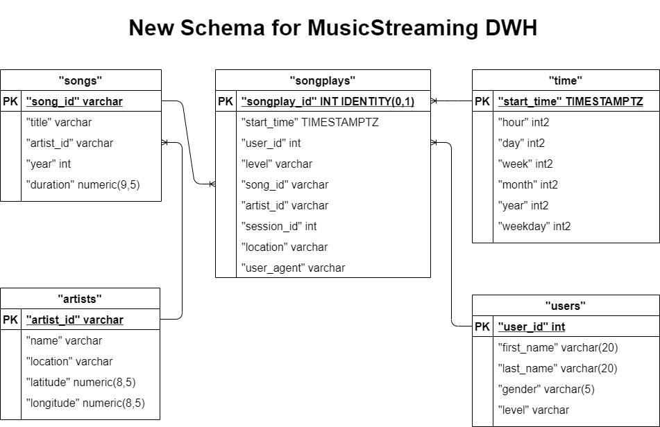
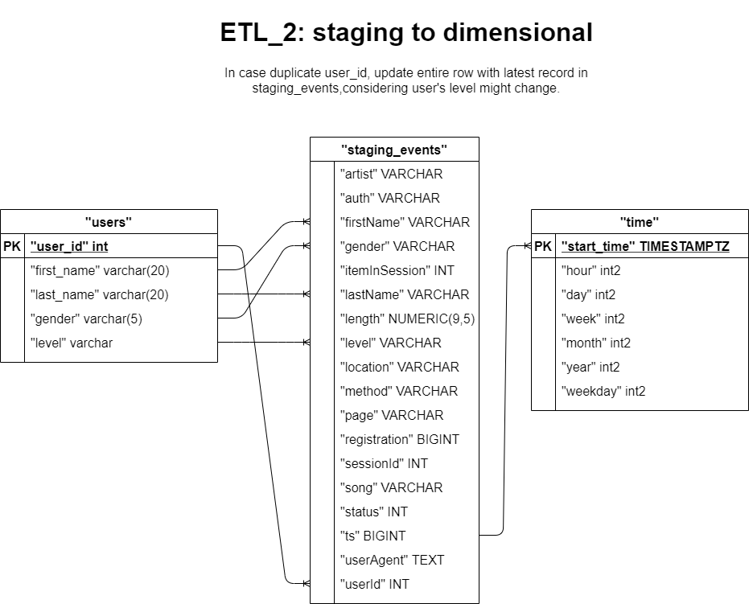
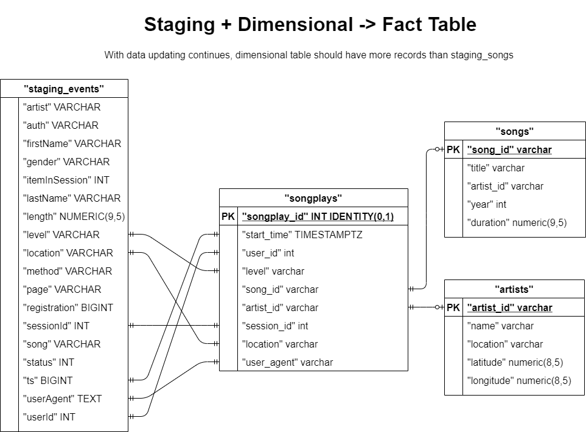

# MusicApp Cloud Data Warehouse Project on AWS

MS is a music streaming service provider, they have an App which can record users activities, 
who from where at what time click which song on which page using which software, these information are stored in JSON format file, 
and stored in AWS S3.

MS historically use on-primise database, now, with the business growing, they would like to move its data warehouse to cloud,
 using AWS Redshift service. Becase it has less upfront cost, service is scalable, reliable, and can cover multi-region.

For this purpose, data engineer need to create and configue a AWS redshift cluster, design a new schema for analytics,
 copy data from S3, and insert into new created tables.

## 1 How to Run the Python Scripts
There are two main python files:
1. First, run *create_tables.py* to create tables in Redshift Cluster.
2. Then, run *ETL.py* to tranform and insert data into new created tables.

Before running these python scripts, redshift cluster as well as role for reading s3
 must be created. 

You can manually do that, and run above two python scripts in terminal.
Or, you can have your use jupyternotebook file *CloudDWH_MusicStreaming.ipynb* to create it in a Iac approach.

	CloudDWH_MusicStreaming.ipynb	--AWS Iac, run python scripts, analytics query
	create_tables.py		--Create 2 staging tables and 5 fact_dimensional tables
	sql_queries.py			--All the DDL DML
	ETL.py				--Transform, upsert data
	dwh.cfg				--Configuration (AWS Access key, cluster host, ARN, S3 bucket)

## 2 Original Data
All the files are stored in S3, below are the bucket and file information

	• Song data: s3://udacity-dend/song_data
	• Log data: s3://udacity-dend/log_data
	• Log data json path: s3://udacity-dend/log_json_path.json

There are 2 types of data: song files, and log files
1.1 Song metadata
Song dataset a from 'Million Song Dataset', here is the link: [Million Song Dataset](https://labrosa.ee.columbia.edu/millionsong/).
Each file is a JSON format data about one song, below is a example:

		{
		"num_songs": 1, 
		"artist_id": "ARJIE2Y1187B994AB7", 
		"artist_latitude": null, 
		"artist_longitude": null, 
		"artist_location": "", 
		"artist_name": "Line Renaud", 
		"song_id": "SOUPIRU12A6D4FA1E1", 
		"title": "Der Kleine Dompfaff", 
		"duration": 152.92036,
		 "year": 0
		}

1.2 Music APP log files
These log files describes users activitiy information: who from where at what time click which song on which page using which software.

Below is a example of log JSON file

		{
		"artist": "Survivor",
		"auth": "Logged In",
		"firstName": "Jayden",
		"gender": "M",
		"itemInSession": 0,
		"lastName": "Fox",
		"length": 245.36771,
		"level": "free",
		"location": "New Orleans-Metairie, LA",
		"method": "PUT",
		"page": "NextSong",
		"registration": 1541033612796.0,
		"sessionId": 100,
		"song": "Eye Of The Tiger",
		"status": 200,
		"ts": 1541110994796,
		"userAgent": "\"Mozilla\/5.0 (Windows NT 6.3; WOW64) AppleWebKit\/537.36 (KHTML, like Gecko) Chrome\/36.0.1985.143 Safari\/537.36\"",
		"userId": "101"
		}

## 3 New Schema

## 4 ETL

there are two staging table in the cluster: staging_events, staging_songs,
purpose is to load data into these staging tables, instead of directly into fact&dimensional tables.

ETL-1 staging -> dimensional tables

ETL-2 staging -> dimensional tables

ETL-3 staging -> fact table

@@

The README file includes 
a summary of the project, 
how to run the Python scripts, 
explanation of the files in the repository. 

Comments are used effectively
each function has a docstring.

17. Discuss the purpose of this database in context of the startup, Sparkify, and their analytical goals.
18. State and justify your database schema design and ETL pipeline.
19. [Optional] Provide example queries and results for song play analysis.
