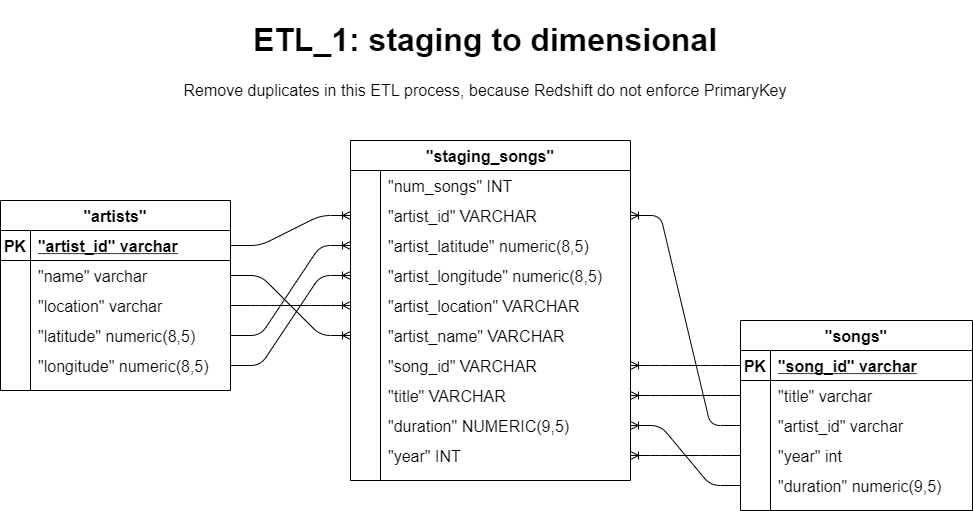

# MusicApp Cloud Data Warehouse Project on AWS

MS is a music streaming service provider, they have an App which can record users activities, 
who from where at what time click which song on which page using which software, these information are stored in JSON format file, 
and stored in AWS S3.

MS historically use on-primise database, now, with the business growing, they would like to move its data warehouse to cloud,
 using AWS Redshift service. Becase it has less upfront cost, service is scalable, reliable, and can cover multi-region.

For this purpose, data engineer need to create and configue a AWS redshift cluster, design a new schema for analytics,
 copy data from S3, and insert into new created tables.

## 1 How to Run the Python Scripts

	fiels in this repo:
	CloudDWH_MusicStreaming.ipynb	--AWS Iac, run python scripts, analytics query
	create_tables.py		--Create 2 staging tables and 5 fact_dimensional tables
	sql_queries.py			--All the DDL DML
	ETL.py				--Transform, upsert data
	dwh.cfg				--Configuration (AWS Access key, cluster host, ARN, S3 bucket)

There are two main python files:
1. First, run *create_tables.py* to create tables in Redshift Cluster.
2. Then, run *ETL.py* to tranform and insert data into new created tables.

But:

Before running these python scripts, redshift cluster as well as role for reading s3
 must be created. 

You can 
 - manually do that, and run above two python scripts in terminal.
 - Or, you can have your use jupyternotebook file *CloudDWH_MusicStreaming.ipynb* to create it in a Iac approach.

If you choose Iac, all the Iac code are scripted in .ipynb file, 
and it has following section:

	PART 1 _ Create IAM role and attach policy
		1.1 Parse 'dwh_1.cfg' file
		1.2 Create Resources & Clients
		1.3 Create IAM role
	Part 2 _ Create Redshift Cluster
		2.1 Create & Validate Cluster
		2.2 Set Security Group and CIDR
	Part 3 _ ETL
		3.1 Create Staging Tables & New Schema
		3.2 ETL (Load,Transform,Insert)
	Part 4 _ Data Analytics
		4.1 How many users in total?
		4.2 How many active users?
		4.3 Top 10 songs
		4.4 How many songs been played for each month?
	Part 5 _ Vacum/Analyze/Delete Cluster/Delete Role

## 2 Original Data
All the files are stored in S3, below are the bucket and file information

	• Song data: s3://udacity-dend/song_data
	• Log data: s3://udacity-dend/log_data
	• Log data json path: s3://udacity-dend/log_json_path.json

There are 2 types of data: song files, and log files
1.1 Song metadata
Song dataset a from 'Million Song Dataset', here is the link: [Million Song Dataset](https://labrosa.ee.columbia.edu/millionsong/).
Each file is a JSON format data about one song, below is a example:

		{
		"num_songs": 1, 
		"artist_id": "ARJIE2Y1187B994AB7", 
		"artist_latitude": null, 
		"artist_longitude": null, 
		"artist_location": "", 
		"artist_name": "Line Renaud", 
		"song_id": "SOUPIRU12A6D4FA1E1", 
		"title": "Der Kleine Dompfaff", 
		"duration": 152.92036,
		 "year": 0
		}

1.2 Music APP log files
These log files describes users activitiy information: who from where at what time click which song on which page using which software.

Below is a example of log JSON file

		{
		"artist": "Survivor",
		"auth": "Logged In",
		"firstName": "Jayden",
		"gender": "M",
		"itemInSession": 0,
		"lastName": "Fox",
		"length": 245.36771,
		"level": "free",
		"location": "New Orleans-Metairie, LA",
		"method": "PUT",
		"page": "NextSong",
		"registration": 1541033612796.0,
		"sessionId": 100,
		"song": "Eye Of The Tiger",
		"status": 200,
		"ts": 1541110994796,
		"userAgent": "\"Mozilla\/5.0 (Windows NT 6.3; WOW64) AppleWebKit\/537.36 (KHTML, like Gecko) Chrome\/36.0.1985.143 Safari\/537.36\"",
		"userId": "101"
		}

## 3 New Schema

There are 1 fact table (songplays), and 4 dimensional tables (songs, artists, time and users).

Below is the ERD for this new schema.

Although redshift does not enforce PrimaryKey, ForeignKey, 
here all the DDL DML operations are follow the order as these rules are enforced.
Create *artists* first, then *songs*, then other *time* and *users*, finally *songplays*.

## 4 ETL

There are two sections of the ETL job, first, using COPY command 
to bulk load data from S3
to staging tables in Redshift cluster, 
second, tranform and upsert data in staging tables into tables of new schema.

**step 1: load data from s3**

Here is the Amazon tutorial for COPY from s3, [link]((https://docs.aws.amazon.com/redshift/latest/dg/tutorial-loading-data-upload-files.html) ) 
including copy JSON files, how to use JSON_Path file, how to check the error during loading, etc..

**step 2: upsert data into dimension tables**

Because Amazon [Redshift does not enforce unique, primary-key, and foreign-key constraints](https://docs.aws.amazon.com/redshift/latest/dg/c_best-practices-defining-constraints.html).
during the upsert, using temp tables to remove duplicate in the target table.

**step 3: upsert data into fact table**

It's OK to just join two staging tables and insert results into song_plays.

However, if there will be another ETL from S3, it's better to get data into dimension table *songs* and *artists*,
then Join them with *staging_events*, because its data set should be larger than the dataset in one staging table.
Plus, we had already remove those duplicates, efficience should be must better to join with dimension tables. 

## 5 About the CloudDWH_MusicStreaming.ipynb

*CloudDWH_MusicStreaming.ipynb* contain several sections:

	PART 1 _ Create IAM role and attach policy
		1.1 Parse 'dwh_1.cfg' file
		1.2 Create Resources & Clients
		1.3 Create IAM role
	Part 2 _ Create Redshift Cluster
		2.1 Create & Validate Cluster
		2.2 Set Security Group and CIDR
	Part 3 _ ETL
		3.1 Create Staging Tables & New Schema
		3.2 ETL (Load,Transform,Insert)
	Part 4 _ Data Analytics
		4.1 How many users in total?
		4.2 How many active users?
		4.3 Top 10 songs
		4.4 How many songs been played for each month?
	Part 5 _ Vacum/Analyze/Delete Cluster/Delete Role

**Recommendation:**

- If you have AMAZON AWS account, and prefer a Iac approach, you can follow the steps in this .ipynb file.
to set your cluster, to create roles and assign to cluster, to set the Security group and CIDR,
with only your AccessKey (KEY and SECRET).

- If you prefer it manually, do it manually, and jump to PART 3 and start from there.

You can run .py in this *Part 3* and check whether tables created or not.

After inserting data, check how many rows are insert into target table,

## 6 Data Analysis Using Current Data
Data analytics is the part 4 of *CloudDWH_MusicStreaming.ipynb*. 
 - 4.1 How many users in total?
 - 4.2 How many active users?
 - 4.3 Top 10 songs
 - 4.4 How many songs been played for each month?

More analytics queries can be added here based on business requirement.

'--------------------This is the end.-----------------------'
